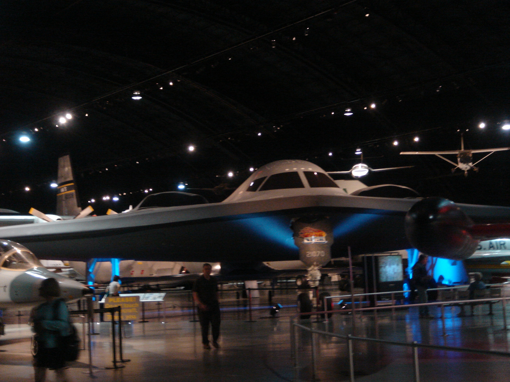

# Dayton Wright Brothers (KMGY)

## On Airport Museum

This airport has a small wright brothers museum and you can ride and a look-a-like Wright-B-Flyer. [video](https://www.youtube.com/watch?v=4GqTq8lDfDM)

## My Favorite Museum

(There are closer airports for this)

If you have a car you can take a 25 minute ride north on I-75. There is the National Air force Museum. 

