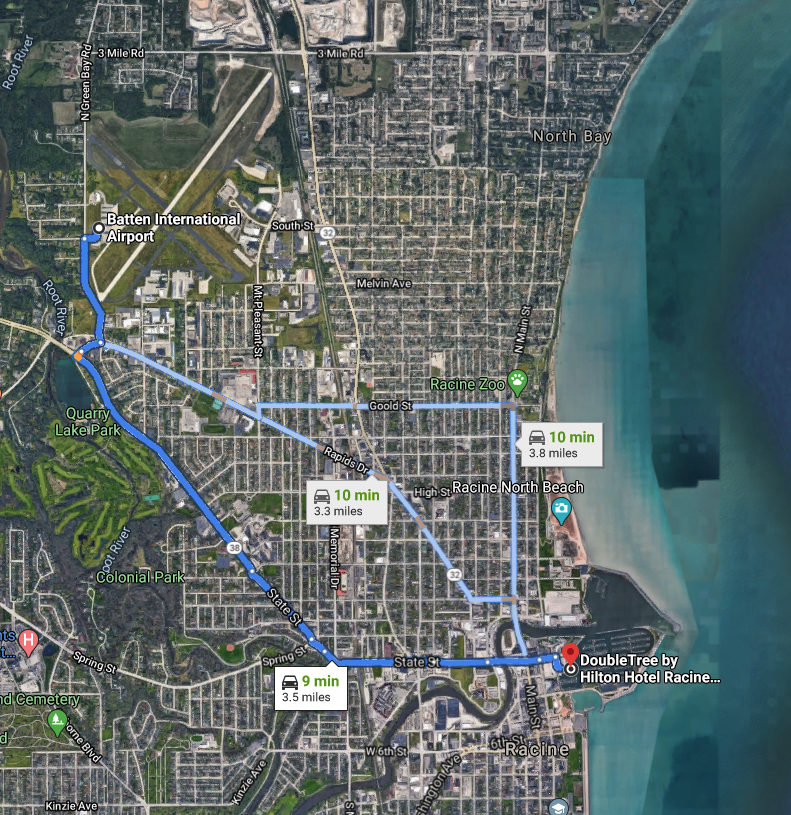
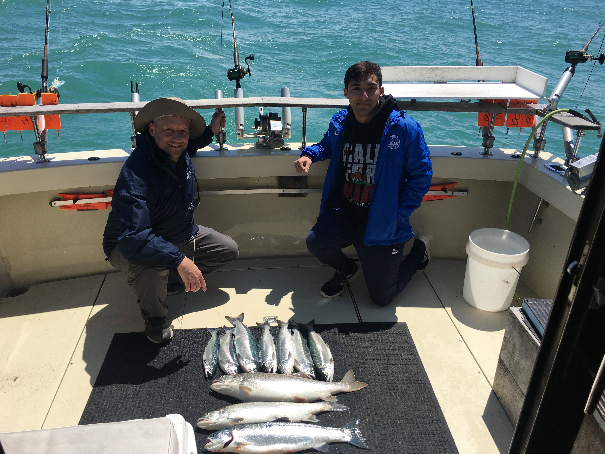
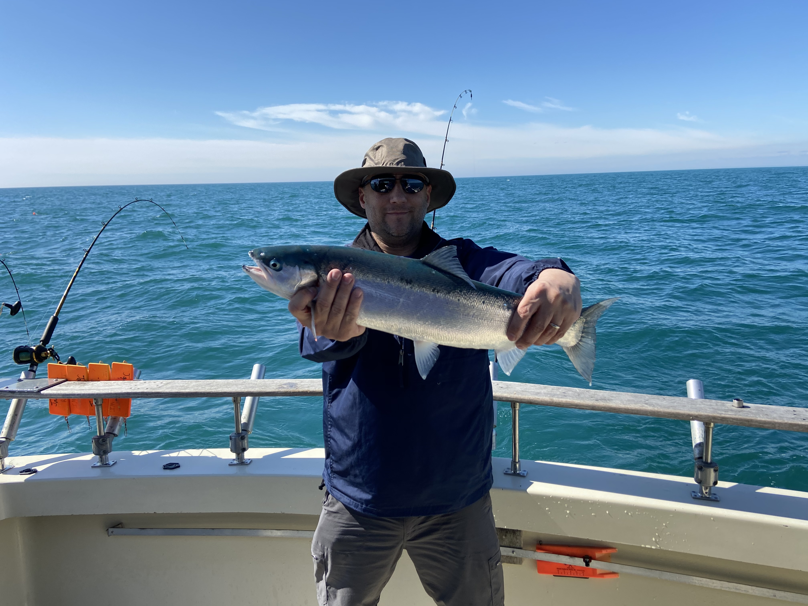

# Racine Wisconsin

If you want to spend a day on or near Lake Michigan and you do not want to go downtown Chicago a great option is to check out Racine, Wi.

The lake is less thank a 10 minute Uber ride from the airport.

## Jackpot Fishing

Site: [JackpotFishing.com](https://jackpotfishing.com/)

This is a full service fishing chart where you can take up to six people. We caught or limit of fish like Coho Salmon, Lake Trout, and Rainbow Trout.

## Porter’s Outdoors

Site: [PortersOutdoors.com](https://www.portersoutdoors.com/)

I've not done this yet but it is also in Racine Wi. In the Fall there are guided hunting trips.